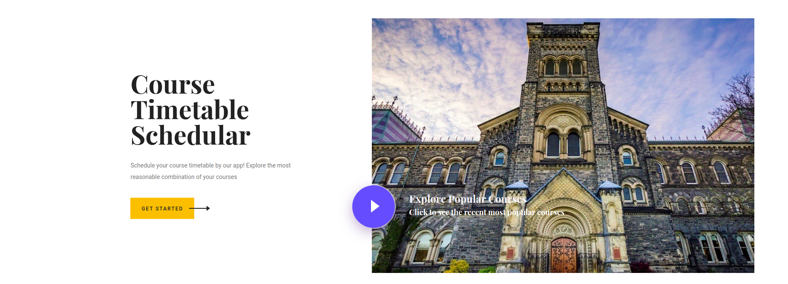
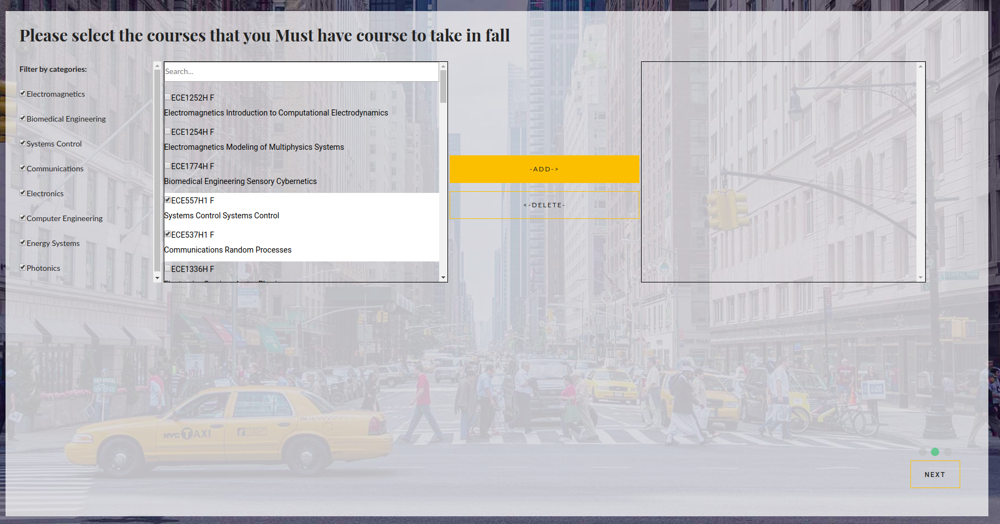
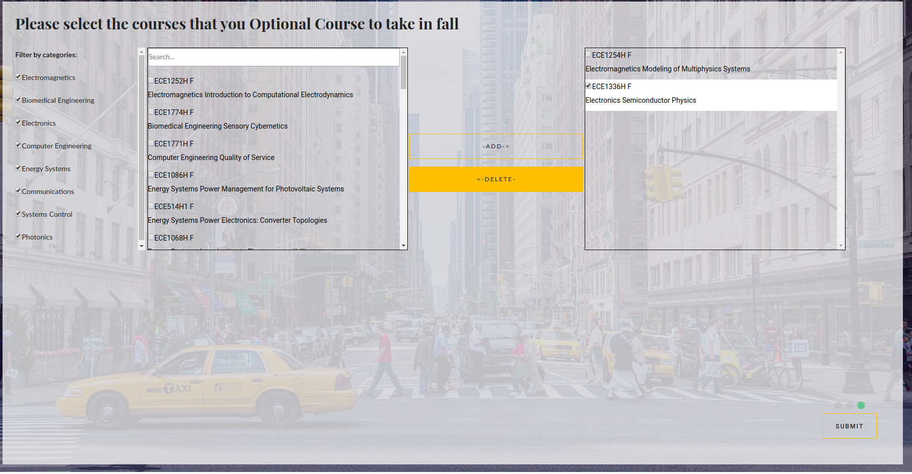

# Smart-Course-Picker-main-app

## Introduction
“Smart Course Picker” collects the newest course information in the database and user can filter the courses he/she want to pick by category and course topics. After selected which courses the user wants to take and which courses the user must want to put into the timetable, the system will run the searching algorithm and display possible non-conflicting solutions. The user can also check the updated statistical diagram of what popular courses other users are searching for to help with the course selection.

## How to use
- Step1:

- Step2:

- Step3:

- Step4:

- Step5:

## Instructions
Deploy the main program  to the Lambda using Zappa.

Developed by:
    Liren (Fred) Pan,
    Yixiao (Felix) Hong,
    Hongzheng  (Chris) Xu.

